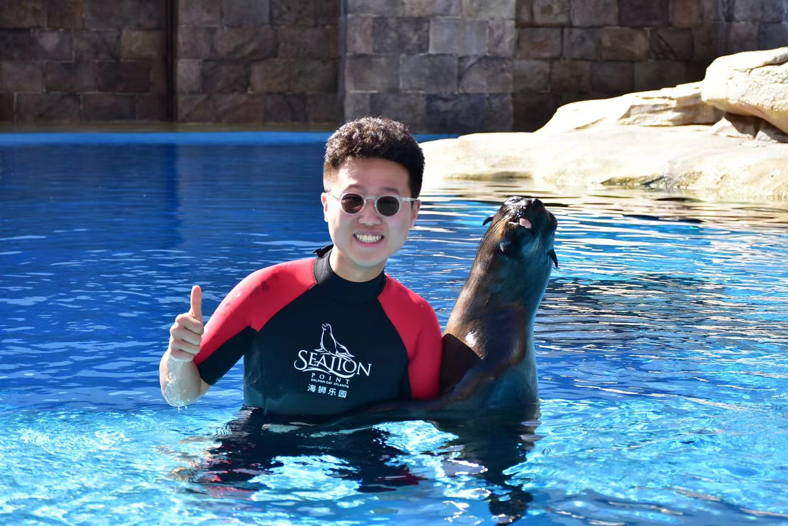

# Zhongyi Wang's User Page

There are four section
[The programmer](the-programmer)
[Hobby](hobby)
[Food Choice](food-choice)
[Task this year](task-this-year)

## The Programmer

As a **programmer**, I think I am not a expert programmer. Before I came to UCSD, I only took two computer science courses. However, I learned a lot in UCSD by taking the courses. When I took *CSE 12*, it usually took me more than 20 hours a week working on the programming assignment every week. I still remember that in PA2, I worked on helper function more than 10 hours. I was extremely anxious at that time, so I could not fall asleep at night. However, I figure out how to code after dozens of tries. That experience makes me confident. Like the old saying, "Practice makes perfect!". No one is born to be expert. Everyone needs to spend time on specific area to become the expert. Although I am not a expert, I believe that I can become the expert someday. `After taking CSE 12, I have new understanding on Java.` I understand how to use heritage, variable, parameters. By the way, my programming skills improve a lot in UCSD. 
My favorite saying:
>Practice makes perfect!

## Hobby
I have different hobbies. Here is the list of my hobbies.
- **Swimming**
- **Running**
- **Playing Tennis**
- **Horse Riding**
- **Traveling**
- **Soccer**
  
My family wants me to play different kinds of sports. When I was young, I play different sport from Monday to Saturday. I only have one day off, so I can take a rest on Sunday. Having hobbies is a good way to make new friends. 

My favorite soccer club is Barcelona. Please check the [official website](https://www.barcelona.com/).

## Food Choice
From my perspectives, I enjoy all kinds of food. The United States is a culture melting pot. I can try diverse dishes. On the top of the list, it is my favorite dishes.

1. BBQ
2. Thai food
3. Italian food
4. Japanese food
5. India food

## Task this year
-[ ] Keep good grade
-[x] Make a girlfriend
-[ ] Find some research oppotunity
-[ ] Looking for an internship
-[x] Stay mentally and physically healthy

